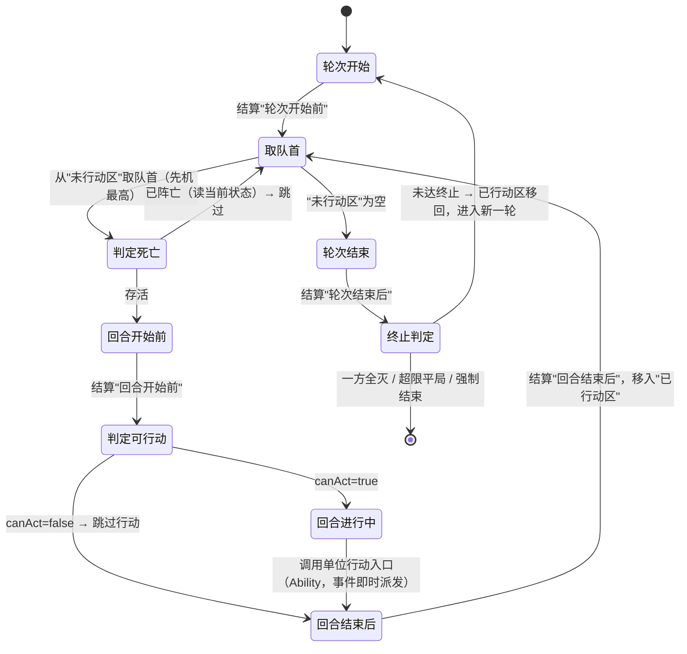

# 战斗回合系统（Turn）重构规范（combat-turn）

Status: ready-for-agent

> 本规范由 wayfinder 地图（`.scratch/combat-turn/map.md`）的 12 个决策 ticket 汇编而成，各章节标注决议来源，可回溯详情。**交付形态为规范，实施为独立 effort（to-tickets）。**

## Problem Statement

当前战斗是硬编码的轮询回合制，无法支撑战斗系统重构（Buff / Effect / Ability 需要接入时机系统）：

1. **硬编码轮询顺序**：英雄按上阵序、敌人按配置序固定轮流行动，没有先机（Initiative）、没有行动队列，无法表达「敏捷决定出手顺序」「控制技能跳过回合」等设计。
2. **无时机/事件系统**：没有任何「回合开始前 / 回合结束后 / 攻击后 / 受到伤害」等触发点，Buff / Effect / Ability 没有可订阅的挂载点，后续模块无从接入。
3. **战斗逻辑与结算耦合**：伤害公式、觉醒技能冷却、集火目标选择都硬编码在战斗循环里，扩展一个行为就要改核心循环。
4. **回放功能 bug 缠身**：血条步进回放（含 hpTrack）导致大量 bug，应删除，只保留战斗信息轮播。
5. **先机不可见**：开发者无法观察单位行动顺序的决策依据，调试困难。

## Solution

把 Turn 重构为**纯确定性流程引擎**：接收已结算的参战单位快照，驱动「轮次 → 回合 → 时机/事件」流程，输出结局与事件流；属性计算（statSystem）、行为逻辑（Ability）、效果结算（Effect）全部外置。

1. **先机回合制**：单位按（先机 降序, 入场序 升序）全序行动，取代固定轮询。
2. **时机/事件系统**：轮次主时机（轮次开始前 / 回合开始前 / 回合进行中 / 回合结束后 / 轮次结束后）+ 细粒度事件（攻击后 / 受到伤害 / 受到治疗 / 死亡 / 召唤），提供统一订阅接口，作为 Effect / Buff / Ability 的挂载点。
3. **纯函数引擎**：单一 seam，确定性、无副作用、RNG 注入，测试与信息轮播都基于同一事件流。
4. **删除回放**：战斗结果输出事件流（供信息轮播展示），不再有血条步进回放。

## User Stories

1. 作为玩家，我想在战斗界面看到战斗信息轮播（哪个时机开始、哪个单位触发哪个能力、哪个单位受到效果、阵亡/召唤），以便理解战斗过程。
2. 作为玩家，我不希望看到先机等隐藏数值，以便界面保持整洁、不被内部机制干扰。
3. 作为玩家，我想让战斗持续播放（在线挂机与主动战斗同节奏），以便体验连贯。
4. 作为玩家，我想让战斗有明确的终止（一方全灭 / 超限平局 / 特殊效果强制结束），以便不会陷入无限战斗。
5. 作为开发者，我想让 Turn 引擎成为纯函数（输入快照 + 配置 + rng → 结局 + 事件流），以便用一套测试断言任意输入组合的确定结果。
6. 作为开发者，我想让同一输入 + 同一 rng 种子产生完全一致的事件流，以便测试与信息轮播可复现。
7. 作为开发者，我想让 RNG 以函数参数注入而非引擎持有，以便生产传 Math.random、测试传固定种子。
8. 作为开发者，我想让 Turn 只接收已结算的战斗单位快照（id/name/faction/hp/maxHp/initiative/abilities/stats），以便属性/先机计算归上层、Turn 职责单一。
9. 作为开发者，我想让单位按「先机 降序, 入场序 升序」严格全序行动，以便行动顺序确定、无并列。
10. 作为开发者，我想让行动队列用单优先队列 + 轮次分隔标记，以便避免双队列交换的语义坑。
11. 作为开发者，我想让先机变动只重排本轮未行动区间（已行动者一轮只行动一次），以便控制技能改变出手顺序而不产生重复行动。
12. 作为开发者，我想让召唤物进入本轮未行动区按先机排位并本轮必行动一次，以便召唤「立即参战」语义明确。
13. 作为开发者，我想让召唤物先机单独计算（agility 按 0 处理，仅 fixval 生效），以便召唤物出手顺序可控。
14. 作为开发者，我想让阵亡单位跳过其后所有主时机、只派发一次死亡事件，以便死亡语义干净、无脏触发。
15. 作为开发者，我想让死亡判定在取出队首单位时读取当前状态（非入场快照），以便复活技能能把单位救回并在其回合正常行动。
16. 作为开发者，我想让 Turn 只提供 canAct 谓词（不硬编码眩晕等枚举），以便控制状态归 Buff 模块、Turn 保持通用。
17. 作为开发者，我想让无法行动单位仍结算回合开始前/结束后、只跳过行动，以便控制效果的衰减与回合后触发不被吞掉。
18. 作为开发者，我想让 Turn 提供时机/事件订阅接口（register/unregister、FIFO、触发上下文），以便 Effect/Buff/Ability 后续接入。
19. 作为开发者，我想让同一时机内新注册的订阅延后到下一次该时机结算，以便防止无限循环。
20. 作为开发者，我想让 Turn 维护可配置轮次上限（默认 60）与强制结束标记，以便战斗必然终止。
21. 作为开发者，我想通过测试断言观察先机与排序（dev 模式经事件流附带调试字段），以便调试出手顺序而不污染玩家 UI。
22. 作为开发者，我想删除血条步进回放组件与 hpTrack，以便消除其 bug 面、只保留信息轮播。

## Implementation Decisions

（各决策详情与讨论见对应 ticket，以下为结论摘要。）

### 1. 术语与概念（来源：回合系统词汇对齐）

- **轮次 (Round)** = 所有存活参战单位各行动一次的一个完整循环；**回合 (Turn)** = 单个单位的一次行动机会（从「回合开始前」到「回合结束后」）。
- **时机 (Timing)** = 轮次主时机（固定骨架）：轮次开始前 / 回合开始前 / 回合进行中 / 回合结束后 / 轮次结束后。
- **事件 (Event)** = 细粒度战斗事件（可扩展、即时派发）：攻击后 / 受到伤害 / 受到治疗 / 死亡 / 召唤。
- **先机 (Initiative)** = 决定行动次序的隐藏属性；整体节奏称「先机回合制 (Initiative Turn)」，取代旧「轮询回合制」。术语已写入 CONTEXT.md。

### 2. 引擎输入（来源：Turn 引擎输入边界）

Turn 接收**已结算的参战单位快照**，只负责流程与时机；属性/先机计算归上层（Entity/statSystem）。快照字段（类型形状级）：

```
战斗单位快照 {
  id           // 战斗内稳定标识
  name         // 显示名
  faction      // 阵营（胜负判定）
  hp, maxHp    // 当前/最大生命（死亡判定 + 信息轮播）
  initiative   // 先机值（战前算好传入）
  abilities    // Ability 引用列表（回合进行中调用）
  stats        // 完整面板（三层算好后的 attack/defense/maxHp/maxMp/critRate/critDmg + 特殊属性，供 Ability 取数）
}
```

入场创建**一次性可变运行时战斗单位**（buff 经重算钩子更新字段），战后整体丢弃（与 readme「创建新战斗快照、自动恢复」一致）。

### 3. 确定性与 RNG（来源：Turn 引擎确定性边界）

- Turn **纯确定性**：先机 / 排序 / 队列遍历 / 时机结算顺序全部固定，不接触 RNG。
- RNG 以**函数参数注入**（`rng: () => number`）传给需要随机的 Ability/Effect；种子化 RNG 由上层（战斗创建方）提供——测试传固定种子、生产传 `Math.random`。
- **删除回放功能**：血条步进回放组件与 hpTrack 不再保留；战斗结果输出**事件流**，仅作信息轮播数据源 + 测试断言。

### 4. 终止条件（来源：轮次上限与平局）

- 保留可配置**轮次上限**（语义 = 轮次，默认 60）；超限双方存活 = **平局**（无奖励、无重伤）。
- Turn 维护**强制结束标记 + 结果**（victory/defeat/draw），战斗循环每轮检查，置位即终止。
- 终止条件封闭集合 = 一方全灭 / 超限平局 / 强制结束。

### 5. 行动队列（来源：行动队列实现）

- **单优先队列 + 轮次分隔标记**（非双队列交换），标记分隔「本轮已行动」与「本轮未行动」。
- 先机变动只重排「本轮未行动」区间；已行动单位锁定，一轮只行动一次。
- 队列支持中途插入到「未行动区间」（召唤物入场）。
- 轮次边界算法：取未行动区队首 → 执行其回合 → 移入已行动区；未行动区空 → 结算「轮次结束后」→ 已行动区整体移回未行动区进入新一轮。
- **取出队首即锁定本轮行动资格**（combat-aftermath 04 写回为正式语义）：分隔标记在 turnStart 主时机派发前即前移（防重入设计）；行动资格在该时点快照判定、本回合内不变（衔接 combat-aftermath 02 D1 眩晕快照制）。turnStart 订阅者读调试队列看到自己已处于已行动区属预期行为。

### 6. 排序规则（来源：同先机排序规则）

- 排序键 = `(先机 降序, 入场序 升序)`，**严格全序**（入场序唯一 → 无并列）。
- 入场序 = 全局单调递增序号：英雄按上阵序 → 敌人按配置序 → 召唤物按召唤序依次续号；升序 = 先入场先动。

### 7. 召唤物（来源：召唤物入场排位）

- 召唤物进入本轮「未行动区」按先机排位（不插队），本轮必行动一次（除非战斗先结束或先被击杀）。
- 召唤物先机**单独计算**：`agility` 按 0 处理（不使用实际敏捷），先机 = `100 + fixval`（fixval 由召唤技能传入，clamp 0–100）；面板其余属性以被召唤实体真实配置为准。

### 8. 回合进行中契约（来源：回合进行中子流程）

- Turn 只驱动骨架：「回合进行中」调用该单位的**行动入口**；选能力 / 选目标 / 派发效果归 Ability。
- 普通攻击 = **兜底 Ability**（每个单位默认持有、Ability 层提供），非 Turn 特判。
- 细粒度事件在效果结算/行为完成时**即时派发**（全部在「回合进行中」内）：伤害结算时派「受到伤害」、hp 归零时派「死亡」、召唤落地时派「召唤」、攻击完成时派「攻击后」；「回合结束后」是独立主时机。

### 9. 死亡时机（来源：死亡时机结算规则）

- 阵亡单位跳过其后所有轮次主时机，只派发一次「死亡」事件。
- 死于自己行动中 → 不结算「回合结束后」（死亡即时终止该回合剩余时机）。
- **死亡判定在「取出队首单位时」读取当前状态**（非入场快照）：正常取出 → 判死亡 → 若死亡则跳过；死单位不预过滤出队，尊重复活技能（若轮到前已被复活则正常行动）。
- 统一规则：存活是结算任何主时机的必要条件。

### 10. 无法行动（来源：无法行动判定）

- Turn 只提供 `canAct` 谓词，由 Buff 状态汇总，不硬编码眩晕等枚举。
- 无法行动只跳过「回合进行中」（行动）；「回合开始前」（含控制衰减/判定）与「回合结束后」仍结算。
- `canAct` 在「回合开始前」结算后、进入「回合进行中」前**判定一次，本回合内保持不变**。
- 判定顺序：先判死亡（跳过一切主时机）→ 再判 canAct（跳过进行中）。

### 11. 时机/事件订阅（来源：时机/事件订阅接口）

- 订阅键 = `(时机/事件 key, 单位 id | 全局)`；单位级时机按单位订阅、轮次级时机（轮次开始前/结束后）全局订阅；值 = 订阅者（效果实例/回调）列表。
- API：`register(key, 订阅者)` / `unregister(key, 订阅者)`；战斗结束订阅表整体清空。
- 结算顺序：FIFO（注册序）固定、不可配置。
- 同时机内再注册：延后到下一次该时机结算，本轮迭代不触发（防无限循环）。
- 触发上下文：至少含 时机/事件 key、当前回合归属单位、来源、目标、战斗运行时引用（只读）；事件数据由派发方附带。

### 12. 回合状态机（由 05/08/09/10 决策修订）



## Testing Decisions

- **什么构成好测试**：只测外部行为——给定「快照列表 + 配置 + rng 种子」→ 断言「结局 + 事件流」，不测内部循环/队列写法。确定性优先：同输入同种子必须产出逐字节一致的事件流。
- **测试 seam（单主 seam，用户已确认）**：Turn 引擎纯函数——输入参战单位快照列表 + 战斗配置（轮次上限等）+ rng，输出 `{ 结局(victory/defeat/draw), 事件流 }`。无副作用、无外部依赖。内部子件（先机计算、排序键、队列/轮次边界、订阅表、canAct/死亡判定）是可单独断言的纯函数，作为聚焦单测的次级 seam。
- **受测模块**：
  - Turn 引擎主 seam（结局 + 事件流端到端，含轮次上限/平局/强制结束）；
  - 排序键纯函数（先机 降序 + 入场序 升序、tie-breaker、先机变动重排）；
  - 队列/轮次边界（一轮一次行动、未行动区清空进新轮、中途插入）；
  - 死亡判定（取出队首读当前状态、尊重复活、死于己方回合不结算回合结束后）；
  - canAct（无法行动跳过行动但结算开始前/结束后、判定一次本回合不变）；
  - 时机/事件订阅（register/unregister、FIFO、同时机内再注册延后、触发上下文）。
- **Prior art**：现有 `simulateBattle` 纯函数测试范式（`combat.test.ts` 的轮询/技能冷却断言）即参照；按新语义**改写或删除**旧轮询测试（用户决策：旧测试不符新功能一律删除）。statSystem 纯函数测试（`statSystem.test.ts`）为「纯函数输入输出断言」的既有范式。

## Out of Scope

- **Effect / Buff / Ability / Entity / Level / UI / Offline 七个模块** —— 各自另立 effort。
- **目标选择（集火 / 嘲讽 / 被攻击优先级）** —— 属 Ability 模块。
- **伤害 / 暴击 / 减伤公式本身** —— 属 Effect/伤害结算，本规范只记录现状（`max(1, atk-def)` 与 `DEF/(100+DEF)` 并存），不决策。
- **存档迁移 / 旧测试兼容** —— 不向后兼容旧存档；旧测试不符新功能一律删除（用户决策）。
- **复活技能的触发与结算** —— 属 Ability/Effect 模块；Turn 只保证「取出队首时读当前状态、尊重复活」。
- **控制效果（眩晕等）的持续时间递减精确时点** —— 属 Buff 模块；Turn 只保证 canAct 判定点与判定结果本回合不变。
- **战斗信息轮播的 UI 实现** —— 属 UI 模块；Turn 只产出事件流作为数据源。
- **先机数值平衡 / 上限重标定** —— 属数值平衡，后续独立处理。

## Further Notes

- **领域术语**：CONTEXT.md 战斗小节已新增「先机回合制 / 轮次 / 回合 / 先机 / 时机 / 事件」术语；实施须遵循。
- **决策来源**：`.scratch/combat-turn/map.md` 的 12 张 ticket（01–12）为唯一权威，本规范为汇编。
- **实施入口**：本规范 + map「🏁 地图完成」为 to-tickets 的输入。
- **回放删除**：`CombatPlaybackView` / `hpTrack` 删除；`BattleResult.actions` 演进为事件流，仅作信息轮播数据源。
- **装配 seam 修订（combat-aftermath 05 拍板）**：`TurnConfig.setup` 将随引擎拆分（`createTurnRuntime(units, config)` + `runtime.run()`）删除——装配层（createBattle）在 run 前完成 BattleContext 构建与全部注册，Turn 输入面收窄。本规范原始接口清单不含 setup，删除后亦无需契约化。
