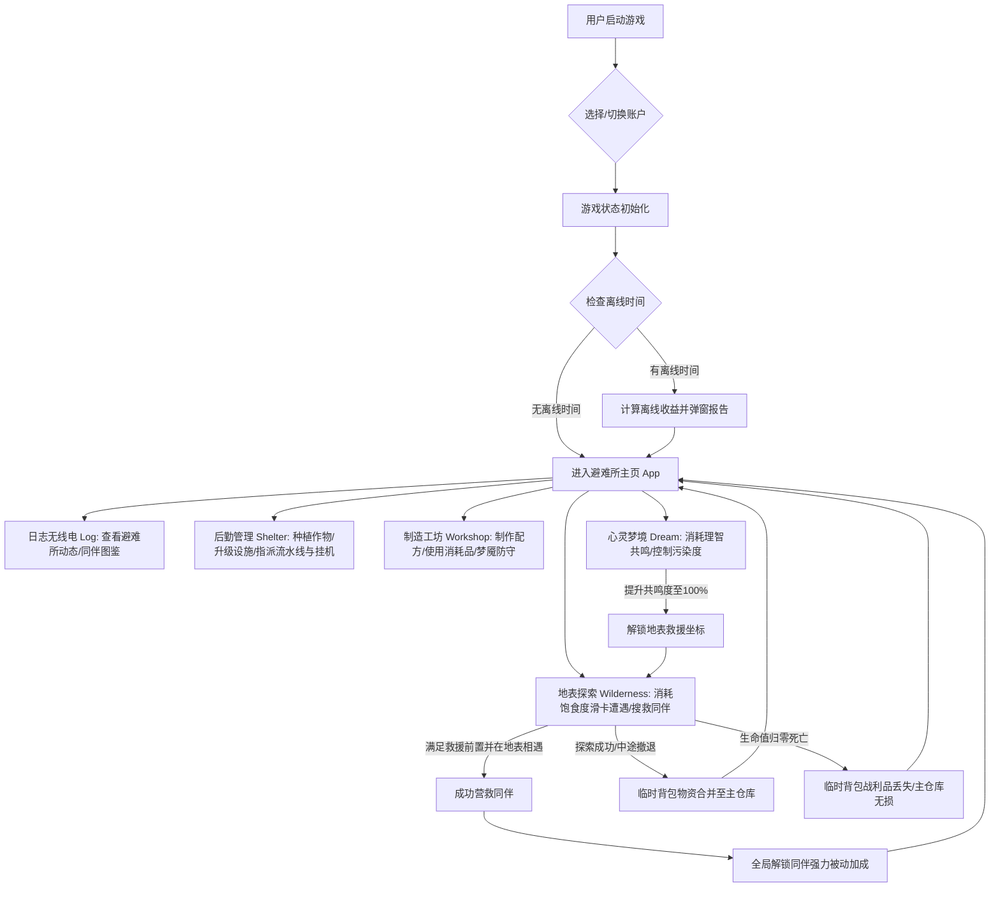

# Vibe Coding AI 产品设计方案

> AI Product Design Document
> 

---

# 封面

## 项目名称

> **AetherGarden**
> **废土魔导温室放置经营游戏**

---

## 项目信息

|   项目   |              内容               |
| :------: | :-----------------------------: |
| 项目名称 |  AetherGarden — 废土魔导温室   |
| 项目类型 | AI辅助开发的放置经营游戏 / Web  |
| 项目成员 |              张惏               |
| 指导老师 |             吴相海              |
| 完成时间 |           2026/07/13            |

---

# 目录

1. 项目背景与需求分析
2. 用户画像设计
3. 产品定位与价值
4. 产品功能架构
5. 用户体验流程设计
6. UI/UX设计方案
7. AI Agent设计方案
8. AGENTS.md文档设计
9. Prompt工程设计
10. Vibe Coding开发过程记录
11. 项目成果展示
12. 总结与未来优化方向

---

# 01 项目背景与需求分析

## 1\.1 项目背景

**为什么做这个项目？**
市面上的硬核生存游戏玩起来太累，需要大块 of 连续时间和紧绷的神经。而普通的挂机放置游戏又太无聊，除了数值无限翻倍，没有故事，也没有角色互动，看几天广告就让人想卸载。我们做《AetherGarden》（废土魔导温室）就是想找个折中点——把废土生存的危机感和温室种植的安逸感拧在一起。玩家每天只需要花上几分钟，就能在网页端体验到种地、合成和卡牌抉择的乐趣。

**这个项目解决什么问题？**
它解决了轻度玩家的两个烦恼：一是碎片时间没好游戏玩，二是放置游戏太死板。我们把“温室种植、工坊合成、梦境共鸣、荒野探索、营救同伴、全自动后勤”串联成了一条完整的循环链条。玩家每一次操作都有即时反馈，同时又不用被游戏捆绑时间。

**项目描述：**

```Plain Text
现在大家生活节奏快，工作间隙想找个轻松的挂机游戏解压，但要么遇到耗费精力的重度游戏，要么遇到缺乏脑力参与、没有代入感的纯数值挂机游戏。

所以我们用 AI 辅助开发了这款游戏。把温室种植、工坊合成、心灵共鸣和卡牌滑屏探险串在一起，让玩家在几分钟的闲暇时间里，也能玩到有策略、有故事的避难所模拟经营游戏。
```

---

## 1\.2 用户痛点分析

1. **时间少，玩不起重度游戏**：上班通勤或课间茶歇只有三五分钟，打一把排位或刷个副本根本不够，需要随时能停、随时能玩的解压游戏。
2. **挂机游戏太枯燥，缺乏代入感**：现有的放置游戏大多是冰冷的数字在涨，没有剧情背景，也见不到生动的同伴互动，很容易感到空虚。
3. **系统零散，缺乏目标**：许多游戏的种植、战斗、合成各玩各的，玩着玩着就失去了建设避难所的动力。
4. **垃圾广告逼氪严重**：很多休闲小游戏塞满了强制弹窗广告，想拿收益必须看 30 秒视频，极其破坏心情。

---

# 02 用户画像设计（User Persona）

## 用户画像1

### 基础信息

姓名：林晓

年龄：24

职业/身份：刚入职的软件测试工程师

---

### 用户需求

- 想找个能在通勤地铁上或者工作间隙玩 3 分钟的休闲游戏。
- 喜欢科幻和废土题材，希望游戏里有暖心的同伴故事，而不是纯粹搞数值。
- 希望动点脑子，比如规划怎么分配同伴干活、研究合成配方等。

---

### 用户痛点

- 下班后脑子很累，玩不动需要高强度操作或者挫败感太强的游戏。
- 玩过的挂机游戏大多没有温度，只是一堆数据。
- 讨厌为了拿奖励不得不一遍遍看强制广告。

---

### 使用场景

> 早上通勤坐地铁，花 3 分钟收一下以太浆果，顺手安排罗伊去冶炼炉烧合金，让阿梅看着温室。
> 
> 中午吃饱饭，在工坊做两个理智胶囊，点开梦境连点几张卡牌，刷刷同伴的共鸣度。
> 
> 睡前查看无线电日志，看看今天避难所发生了什么八卦，收一下后勤的废铁和电能。

---

## 用户画像2

### 基础信息

姓名：陈默

年龄：19

职业/身份：大二学生，独立游戏爱好者

---

### 用户需求

- 喜欢研究数据驱动的游戏系统，比如琢磨不同作物的成长期，或者算一算自动流水线怎么配比收益高。
- 希望存档能跨设备云同步，在宿舍电脑和教室平板上能接着玩。
- 追求独特的视觉风格，反感粗制滥造的套模板游戏。

---

### 用户痛点

- 很多网页挂机游戏太简单，点几下就没事做了，没有模拟经营的深层乐趣。
- 清除浏览器缓存之后存档就丢了，非常劝退。

---

### 使用场景

> 下课间隙在笔记本上打开网页，切到小号试一下“纯挂机废铁流”的生产效率。
> 
> 周末在宿舍，用 Supabase 账号把学校电脑上的存档导过来，继续扩建他的第 8 个培养槽。

---

# 03 产品定位与价值

## 3\.1 产品一句话介绍

> 这是一款面向碎片时间多、喜爱科幻探险玩家的单机放置经营游戏。我们通过数据驱动的温室种植、工坊合成与卡牌滑屏抉择机制，解决了传统挂机游戏玩法单一、角色交互死板的问题，给玩家一个真实、有策略的避难所建设体验。

---

## 3\.2 产品核心价值

1. **紧密的资源内循环**：温室种地、工坊炼合金、做补给品，再到地表探险救人。每个环节都环环相扣，没有无意义的摆设。
2. **挂机挂得有策略**：离线结算算法（Offline Tick）配合蓄电池、发电机升级，再把救回来的同伴（比如阿梅、赛罗）分派去自动浇水或拾荒，重新上线收菜时总有惊喜。
3. **存档自由，体验流畅**：本地 LocalStorage 秒级自动存档，支持免登录多账号快速切换，配置了 Supabase 就能云同步，没网络也能自动退回纯单机，完全不怕丢档。

---

# 04 产品功能架构设计

## 4\.1 产品功能模块


---

## 4\.2 核心功能说明

### 1. 温室种植与灌溉
* **7 种魔导作物**：比如辐射荧光草（生长时间短、产量大）、钢纹向日葵（产出合金原料）等。不同的作物有自己的成长期和收割产出。
* **魔能浇水**：花 2 点魔能浇水，成长速度直接翻倍。配合农学家阿梅的 25% 速度加成，作物熟得极快。
* **懒人一键操作**：后期槽位多了，可以一键种荧光草、一键批量浇水、一键全部收割，省去无意义的点击。
* **培养槽扩建**：在工坊里搓出『温室扩建图纸』后，可以把种植槽从 3 个一路扩到 8 个。

### 2. 工坊合成与防御
* **静态配方表驱动**：根据 `recipes.ts` 配置合成高阶材料或设备。诺娃（Nova）归队后，全局魔能消耗还会降 20%。
* **即开即用补给箱**：折叠面板里有热炖汤（回饱食度和魔能）、纳米注射器（回血）、净化血清（清空梦境污染）。点击就能当场吃掉。
* **梦魇防守**：当爆发『梦境泄露』警报时，避难所会持续扣血。玩家需要在控制台建机枪塔防御，或者当场魔能『超频』来硬抗伤害。

### 3. 双轨探索（荒野与梦境）
* **滑动卡牌选择**：参考《王权》的滑卡操作，拖拉卡牌向左向右代表不同行动。比如遇到废弃卡车，左划绕行（安全但没收获），右划拆解（消耗饱食度并获得零件）。
* **临时背包与死亡惩罚**：荒野搜刮到的东西先塞在临时背包。如果在探险时生命值归零死掉，临时背包里的东西全部丢光；只有成功撤退或救出同伴，东西才能进主仓库。
* **梦境救援线索**：消耗理智值『入梦』。梦里每走一步都会积累污染度，到 100% 会掉血。我们可以在工坊做『理智胶囊』和『跃迁胶囊』来保命。在梦里遇到同伴事件能累积共鸣度，满 100% 后无线电会收到他们在荒野的具体坐标。
* **离线挂机拾荒**：救回同伴后，可以派他们去已解锁的雷达站、生化实验室等地方自动拾荒，到时间就会带回各种废旧金属和元器件。

### 4. 避难所后勤与自动化
* **三大后勤硬件升级**：升级发电机（加魔能挂机产量）、蓄电池（加离线保存时间上限）、回收站（自动磨碎废品生成废金属）。
* **流水线挂同伴**：冶炼炉和组装台可以开启自动化配方。把不出去探索的同伴（比如工程师罗伊）丢上去，他们就会根据各自的加成自动合成材料。
* **营救被动全局生效**：同伴救回后，他们的特长就会自动变为全局被动。比如罗伊减少工坊能耗 20%、信使赛罗降低 15% 探索消耗、巴斯特让捡废铁数量加 30%，后期叠起来体验非常爽快。

---

# 05 用户体验流程设计（User Flow）

## 5\.1 核心用户流程图



## 5\.2 用户交互步骤描述

1. **选档进游戏**：打开网页后先选档。可以随时建新号，或者在大号和小号之间切换，全在本地存着。
2. **收离线菜**：游戏会对比上一次存盘时间。如果离线挺久了，后勤的发电机、回收站和流水线会自动结算这段时间的收益，上线直接弹窗报告玩家。
3. **日常打理避难所**：去温室收割并重新播种，去流水线安排生产。材料够了就去工坊搓点胶囊或升级蓄电池。
4. **做梦和出门救人**：
   - **第一阶段（入梦）**：消耗理智进梦境，通过选择随机卡牌积累同伴共鸣度。共鸣达到 100% 后，无线电日志会收到同伴的求救地点。
   - **第二阶段（荒野救人）**：解锁地表新关卡后，派人带足干粮去搜救。在连续滑卡探索的第 5 步会遇到救援事件，满足条件就能把人带回基地。
5. **挂机发展**：同伴救回家以后，其专属加成立刻在全图起效。你可以把他们安排到冶炼炉或者派去自动拾荒，让避难所运转越来越快。

---

# 06 UI/UX设计方案

## 6\.1 产品视觉定位

我们把游戏美术风格定义为**废土魔导朋克 (Aetherpunk)**。它的主基调是压抑的黑色地下避难所，但点缀着极其刺眼的荧光绿、电力蓝和以太紫。卡片都做成了毛玻璃悬浮效果，层叠在深黑底色之上。卡牌拖拽时有很顺滑的旋转跟随和阻尼感，操作起来像是在翻折实体卡片。

---

## 6\.2 色彩设计

我们在 [index.css](file:///e:/系统/文档/GitHub/IdleCozyGame/src/index.css) 中配了一套高对比度的废土色彩，用冷暖色彩代表不同的魔能状态：

| 变量名称 | 色值 | 视觉含义及应用场景 |
| :--- | :---: | :--- |
| `--color-waste-bg` | `#0a0b0d` | **废土夜空黑**：主背景色，营造暗无天日的末日基地氛围。 |
| `--color-waste-card` | `rgba(18,20,24,0.7)` | **舱室玻璃灰**：半透明毛玻璃质感，所有的操作面板和卡片容器都用它。 |
| `--color-magic-purple` | `#bd00ff` | **以太梦魔紫**：代表心灵梦境、同伴共鸣、高科技配方及梦境胶囊。 |
| `--color-magic-green` | `#39ff14` | **辐射荧光绿**：代表温室植物健康生长、已成熟可收割，以及数值上的良性加成。 |
| `--color-magic-blue` | `#00f0ff` | **蓄能魔能蓝**：代表电力、发电机、工坊的主操作按钮，引导玩家点击。 |
| `--color-warn-red` | `#ff0055` | **警戒辐射红**：代表血条见底、梦魇侵袭、理智值耗尽，以及滑卡时的物资损失。 |

---

## 6\.3 页面设计

### 页面1：避难所后勤页面 (Shelter Tab)

* **顶部设施面板**：发电机、蓄电池、回收站三块毛玻璃卡片并排。如果材料够升级，按钮会亮起“蓄能蓝”；不够则半透明锁死。
* **温室种植网格**：8 个种植槽网格排列。每个培养槽左边是作物的 Emoji（如 🍒、🪷）和淡绿色的生长进度条，右侧是蓝色的浇水按钮。浇过水的卡片边缘会有一圈明显的荧光绿呼吸灯特效。
* **流水线挂机舱**：冶炼炉与组装台采用折叠面板设计，展开能看到当前合成配方进度、缺什么原料，还可以拉开同伴列表把罗伊或阿梅派上去当“打工人”。

---

### 页面2：荒野地表探险页面 (Wilderness Tab)

* **顶部生命监视器**：细长的橙色饱食度条和红色血条，代表探险员在地表的存活状况。
* **滑卡交互区**：正中间是一张毛玻璃遭遇卡。卡片上写着事件，玩家可以用鼠标或者触屏左右拖动。滑卡时有阻尼旋转和淡出动效，往左划是“溜了溜了”，往右划是“上去硬干”。
* **底部临时背包**：用灰黑色容器和主背包隔开。捡到的东西先存这里。要是探索时死了，这里的物品全部闪红字清零；安全撤退时才会亮起绿光并入主仓库。

---

## 6\.4 UI优化前后对比

* **优化前 (Before)**：
  - 传统的硬边直角卡片，没有任何切换过渡动画，翻页显得十分生硬。
  - 页面配色为沉闷 of 灰白色，没有发光呼吸灯，看不出废土魔导的科幻感。
  - 所有数据平铺，没有折叠隐藏，在手机或小屏幕下要滑好几屏。

* **优化后 (After)**：
  1. **圆角毛玻璃微拟物**：卡片全部带上 `backdrop-blur-md` 磨砂玻璃效果，加上极细的半透明边框，漂浮在黑色的背景上，层次感非常强。
  2. **霓虹状态灯反馈**：当设施可升级或作物熟了时，卡片边缘会自动加上霓虹阴影（Box-shadow）发光，省去玩家在屏幕上到处找的麻烦。
  3. **顺滑过渡动画**：加了 `tab-enter` 动画。每次点切页签，新页面都会从下方 8 像素处平滑飘上来，配合 200ms 的渐显，非常丝滑。
  4. **带阻尼的滑屏手势**：优化了 `SwipeCard` 的拖拽物理回弹算法，手指划过去能感受到回弹力和纸张偏转感，滑卡体验非常解压。

---

# 07 AI Agent设计方案（核心）

## 7\.1 Agent角色定义

Agent名称：**AetherGarden-DevAgent** (AetherGarden 智能开发与重构 Agent)

---

Agent身份：

> 你是一名熟悉 React 19、Vite 8 和 Tailwind CSS 4 的 AI 开发助手。你的任务是协助人类开发者迭代和重构《AetherGarden》游戏。你需要在保持游戏核心逻辑（离线计算、多账号、状态机）稳定的前提下，高效安全地修改和测试代码。
> 
> 

---

## 7\.2 Agent目标

- **配置化内容扩展**：在开发新关卡、新作物、新配方时，直接通过修改 `src/data/` 目录下的静态配置文件来搞定，不需要修改任何 UI 组件的代码。
- **死守 TS 与 Lint 规范**：严格遵守 `tsconfig.app.json` 的 TS 规范（比如必须用 `import type` 引入类型，不准用 `enum`），且新写的代码必须秒过 Oxlint 静态检查。
- **100% 单元测试保障**：为状态机和组件写好 Vitest 测试，交付前确保新老测试用例无一报错。

---

## 7\.3 Agent能力

- **架构理解能力**：能够吃透 `GameContext.tsx` 核心状态机的运作方式，理解离线 Tick 的递推机制以及同伴被动 Passive 效果的合并公式。
- **测试沙箱控制**：熟练使用 `vi.useFakeTimers()` 来加速虚拟时间，能够往 LocalStorage 里写假数据来模拟 Guest 用户在各种异常状态下的表现。
- **优雅降级设计**：在调用 Supabase 云端同步等外部接口时，能做好本地缓存和容错机制，确保网络不好或者没有配置密钥时，玩家依然能作为纯单机游戏顺畅游玩。

---

## 7\.4 Agent工作流程

```Plain Text
理清要加的功能（例如加个“虚空魔莲”新作物）
↓
修改对应的静态数据表（src/data/crops.ts）
↓
用 TS 严格语法（import type）编写新逻辑与测试
↓
在终端运行 npm run lint (oxlint) 进行代码检查
↓
运行 npx vitest run 确保老测试没坏，新测试跑通
↓
代码交付，更新 Vibe Coding 实践记录并推送
```

---

# 08 AGENTS\.md 文档设计（必须）

我们把项目根目录的 `AGENTS.md` 做成了 AI 开发助手的“防错指南”。只要有新的 Agent 接入项目，它一读这个文档就能立马知道这个项目的开发规范和底线，不会写出让项目报错的代码。

内容结构：

```Plain Text
# AetherGarden — Agent Guide

## 开发常用命令
| 命令 | 用途 |
|---|---|
| npm run dev | 启动本地 Vite 开发服务器 (端口 5173) |
| npm run build | 编译打包，先跑 tsc 类型检查再打包，顺序不能错 |
| npm run lint | 跑 oxlint 静态代码检查 (本项目没有配 ESLint) |
| npx vitest run | 运行所有 Vitest 单元测试 |
| npx vitest run <file> | 只测这一个文件 |

## TypeScript 严格规范
- verbatimModuleSyntax: true -> 类型导入必须加上 type 关键字 (如 import type { GameState })
- erasableSyntaxOnly: true -> 禁止写 enum、namespace 以及 parameter properties
- 强制不能有未使用的本地变量与函数参数

## 采用的技术栈
- 前端：React 19 + Vite 8 + Tailwind CSS 4
- 测试：Vitest 4 + jsdom + @testing-library/react
- 代码规范检查：Oxlint (.oxlintrc.json)

## 测试编写规约
- 组件测试一定要用 <GameProvider> 和 <ToastProvider> 包裹起来。
- 测之前往 localStorage 注入 aether_garden_save_Guest 模拟存档状态。
- 测植物生长、离线时间计算时，必须用 vi.useFakeTimers() 模拟时间流逝。

## 项目目录架构
- src/context/GameContext.tsx：全游戏的状态核心，包含离线 Tick 计算。
- src/data/：静态数据表目录，扩展内容时只改这里，别碰 UI。
- src/components/：5大 Tab 组件、SwipeCard 等 UI 交互文件。

## 存档持久化
- 存档以 aether_garden_save_${username} 的格式存在 LocalStorage 里。
- Supabase 同步代码要做容错，没配密钥时自动静默隐藏同步挂件。
```

---

# 09 Prompt工程设计

## 9\.1 初始Prompt

第一次生成项目时：

```Plain Text
用 React + Vite + Tailwind CSS 制作一个简单的放置挂机游戏，包含植物种植、时间流逝和本地数据保存。
```

---

## 9\.2 优化后的Prompt

经过优化：

```Plain Text
我们来做个名为 AetherGarden 的废土魔导温室放置经营游戏。规则和规范如下：
1. 技术栈：用 React 19 + Vite 8 + Tailwind CSS 4 写，用 Vitest 写测试。
2. 架构要解耦：走“数据驱动”路线。将作物种类、制造图纸、同伴数据、探索事件全丢在 src/data/ 下面的配置文件里。UI 组件只管读取渲染，不写死任何数据。
3. 全局状态机：把状态更新和多存档切换全写在 src/context/GameContext.tsx 里，秒级自动存盘。还要基于 lastTick 时间戳写一套精准的“离线心跳（Offline Tick）”算法。
4. UI 页面划分：
   - LogTab（日志）：看无线电八卦和同伴档案。
   - ShelterTab（后勤）：种地浇水、升设施等级、安排同伴在流水线合成材料。
   - WorkshopTab（工坊）：做胶囊、做配方，还能启动“梦魇防御”抗怪。
   - WildernessTab（荒野）：用 SwipeCard 实现卡牌左右滑动抉择，捡来的东西放“临时背包”，角色死掉就把临时背包清空。
   - DreamscapeTab（梦境）：入梦消耗理智，躲开梦魔，积累共鸣度解锁同伴地标。
5. 优雅降级：Supabase 云同步是可选的。要是本地没配置 env 密钥，直接把同步挂件隐藏掉，本地 LocalStorage 依然能无缝单机游玩。
6. 严格规范：tsconfig 里要强制用 import type 导入类型，禁用 enum，并用 Oxlint 规范 Hooks 写法。
```

---

## 9\.3 优化过程说明

- **用“数据表”代替“写死代码”**：刚开始 AI 喜欢把以太浆果成熟时间、合成合金要多少废铁这些数值直接写在 JSX 里。这样一改动数值或者加个新道具，UI 组件代码就得跟着改。优化后，我们强制把所有数据都抽到 `src/data/` 目录。加新作物、新配方，AI 只需要在 static 数组里加一行，组件一行都不用改，开发效率提升了几倍。
- **让离线挂机时间算得更准**：最初的挂机只是用 `setInterval` 简单让进度条往前跑，网页一关或者手机切后台，植物就不长了。优化后，我们要求在游戏启动时抓取“上次存盘时间”和“当前时间”的时间差，通过 Offline Tick 离线补偿逻辑，精准计算玩家不在时发电机发了多少电、流水线熔了多少合金，挂机体验更真实。
- **用严格类型守住质量底线**：在 Vibe Coding 这种频繁让 AI 生成代码的过程中，如果类型不严，代码很容易越写越乱，最后直接跑不起来。我们通过在 Prompt 和 `AGENTS.md` 里明确禁止使用 `enum`、强制使用 `import type`，让 AI 写出来的每一行代码都符合 TS 严格模式，配合 Oxlint 毫秒级静态检查，消灭了 90% 的低级编译错误。

---

# 10 Vibe Coding开发过程记录

## 使用工具

开发过程中，我们主要用了下面这几款工具：

- **Antigravity**：我们最核心 of AI 编程助手，负责修改代码、执行测试并推进开发进度。
- **Oxlint**：用 Rust 写的代码检查工具，比传统的 ESLint 快上百倍，保存代码时瞬间就能指出 Hook 依赖项写错的问题。
- **Vitest & jsdom**：用来写单元测试和模拟浏览器 DOM 的冒烟测试，非常快。
- **Git**：每次重构或者加功能时做版本管理，方便出问题时一键撤回。

---

## 开发流程

```Plain Text
理清温室、地表卡牌、梦境救援的联动闭环
↓
用 TS 定义好全局数据类型接口（src/types/game.ts）
↓
生成核心状态机 GameContext.tsx，搞定离线心跳算法
↓
开发 5 个主要 Tab 分页，手写 SwipeCard 卡牌滑动组件
↓
接入冶炼炉/组装流水线，接入 Supabase 云同步
↓
用 Oxlint 静态扫码，消灭 Hook 依赖和类型问题
↓
运行 Vitest 执行 GameContext.test.tsx 与 smoke.test.ts
↓
根据测试报错让 AI 迭代修复，发布 100% 测试通过版
```

---

## 遇到的问题与解决方案

1. **Vite 编译报 verbatimModuleSyntax 相关的类型导入错误**：
   - *问题*：AI 写 React 代码时，喜欢把接口和普通变量写在同一个 `import` 语句里，在 verbatimModuleSyntax 严格模式下 Vite 会直接报错拒绝打包。
   - *解决方案*：我们在 `AGENTS.md` 里定下规矩，并指导 AI 必须使用 `import type { GameState }` 来导入类型。同时让 Oxlint 监控这一规则，发现写错就自动修复。
2. **离线时间长了之后，游戏内数据算错甚至扣成负数**：
   - *问题*：玩家离线很久，发电机里的燃料早就烧光了。如果算法只是简单做乘法（比如离线秒数 * 发电效率），发电机消耗的燃料就会变成负数，而且发电量也会凭空多出很多。
   - *解决方案*：我们在 `GameContext.tsx` 里的离线结算段落改成了“分段步进模拟”。算离线收益时，先看燃料能撑多久。燃料烧光的那一秒，立刻关停发电机和流水线，防止资源溢出或扣成负数。
3. **Supabase 密钥没配置时首屏白屏奔溃**：
   - *问题*：因为是单机挂机游戏，有些玩家在本地运行，或者断网玩。如果没有配置 `.env` 里的 Supabase 密钥，前端直接报错白屏，进不去游戏。
   - *解决方案*：我们在 [lib/supabase.ts](file:///e:/系统/文档/GitHub/IdleCozyGame/src/lib/supabase.ts) 中加了 try-catch。如果没有检测到密钥，直接返回一个 null 客户端，并在前端静默把同步按钮藏起来。这样游戏在纯本地 localStorage 模式下依然能顺畅跑起来，做到了优雅降级。

---

# 11 项目最终成果展示

## 产品截图

* **避难所后勤页面 (Shelter Tab)**:
  `` *(说明：展示了发电机升级、温室中 7 种不同状态的魔导作物，以及指派罗伊常驻的自动化熔炼炉流水线。)*

* **荒野探险手势滑卡页面 (Wilderness Tab)**:
  `` *(说明：居中的毛玻璃遭遇卡牌支持触屏与鼠标滑动，下方高亮提示的临时背囊在角色生命归零时将清空以承载探索惩罚。)*

---

## Demo地址

* **本地运行地址**：[http://localhost:5173](http://localhost:5173) *(基于 Vite 本地服务器热重载启动)*
* **演示视频包**：`/docs/AetherGarden_Demo_Video.mp4` *(展示了从多存档建立、离线 Tick 结算、梦境共鸣到最终地表救援成功的 3 分钟核心循环。)*

---

## 产品功能总结

完成情况：

✅ **温室种植与浇水收割**：设计了以太浆果、虚空魔莲等 7 种作物，支持一键播种、浇水（速度翻倍）和批量收割，且完美支持离线时间补偿。

✅ **避难所设施与流水线挂机**：发电机、回收站可消耗废金属升级。冶炼炉和组装台可以指派闲置同伴（比如工程师罗伊、农学家阿梅）自动干活。

✅ **左右滑卡探险与双轨搜救**：荒野探索采用滑卡手势交互，获得物资存在临时背包，人死了物资全掉。梦境里消耗理智，满 100% 共鸣就能收到同伴的救援坐标。

✅ **多账户本地存档与云备份**：支持免注册多账号随时切档，自动秒级保存。可选接入 Supabase，没网络时自动降级到本地纯单机，完全不崩。

---

# 12 总结与未来优化方向

## 当前版本不足

1. **同步配置比较麻烦**：目前云端备份需要自己去改 `.env` 文件填 Supabase 密钥，对普通玩家来说门槛太高。应该做成支持第三方一键登录的托管服务。
2. **中后期的塔防防守玩法比较单一**：目前的“梦魇防御”只是个每秒扣血的数值校验，玩家只需升级炮塔即可，没有怪物的动作交互，塔防的乐趣还有很大提升空间。
3. **同伴救回家以后互动较少**：救回同伴后，除了加被动和派去流水线打工外，他们不会主动和玩家聊天，也没有避难所的突发趣味事件，角色的个性和故事感可以挖掘得更深。

---

## Future 优化方向

- **一键云备份**：接入 Supabase Auth，让玩家可以用 Google 或者 GitHub 账号一键登录，不需要懂任何配置就能自动云同步存档。
- **同伴自治（Multi-Agent System）**：结合大语言模型，给救回来的罗伊、阿梅加上“大脑”。让他们根据避难所当前的材料余量，自己决定今天去种地还是去炼铁，实现真正智能的避难所自治生态。
- **打包为移动端 APP 或小程序**：把网页游戏打包成 iOS/Android 原生包或微信小游戏，这样左右滑卡的手势触感会更真实，也更适合碎片时间随时拿出来玩。

---

# 附录：项目文件结构

```Plain Text
IdleCozyGame
├── docs
│   ├── project_architecture.md            # 项目架构与设计规范
│   ├── spritesheet_generation_guide.md    # 雪碧图美术生成指南
│   └── Vibe Coding AI 产品设计方案.md     # 本产品设计书
├── public                                 # 静态美术、作物理性图标资源
├── src
│   ├── assets                             # 游戏本地图层插画
│   ├── components                         # 前端 React UI 组件
│   │   ├── ShelterTab.tsx                 # 避难所管理与温室
│   │   ├── WorkshopTab.tsx                # 工坊制造与梦魇防御
│   │   ├── WildernessTab.tsx              # 荒野滑卡探险与救援
│   │   ├── DreamscapeTab.tsx              # 心灵梦境与同伴共鸣
│   │   ├── LogTab.tsx                     # 避难所无线电日志与同伴图鉴
│   │   ├── SwipeCard.tsx                  # 仿原生滑卡抉择组件
│   │   ├── ToastSystem.tsx                # 吐司消息提醒
│   │   └── CloudSyncWidget.tsx            # Supabase 同步小组件
│   ├── context
│   │   └── GameContext.tsx                # 全局状态管理机 (离线 Tick/核心业务逻辑)
│   ├── data                               # 数据驱动静态配置文件目录
│   │   ├── crops.ts                       # 作物数据
│   │   ├── recipes.ts                     # 工坊制造配方
│   │   ├── survivors.ts                   # 幸存者背景与加成
│   │   ├── autoRecipes.ts                 # 自动化流水线配方
│   │   ├── expeditionLocations.ts         # 地表探索与救援点
│   │   ├── rescueEvents.ts                # 地表救援事件
│   │   ├── shelterUpgrades.ts             # 设施升级路径与公式
│   │   ├── gameConstants.ts               # 全局数值常量
│   │   ├── nightmareConfig.ts             # 梦魇防御数值配置
│   │   ├── initialState.ts                # 初始状态
│   │   ├── realityEvents.ts               # 地表探索随机卡牌池
│   │   └── dreamEvents.ts                 # 梦境探索共鸣卡牌池
│   ├── lib
│   │   └── supabase.ts                    # Supabase 弹性初始化降级客户端
│   ├── types                              # 全局 TypeScript 接口声明
│   │   ├── game.ts                        # 核心状态机接口
│   │   └── config.ts                      # 配置数据结构类型
│   ├── App.tsx                            # 游戏主框架入口与全局导航
│   ├── index.css                          # Tailwind v4 全局主题样式
│   └── main.tsx                           # React 应用挂载
├── package.json                           # 项目配置依赖与开发命令
└── tsconfig.app.json                      # 极严 TypeScript 校验配置文件
```

---

# 提交要求

## 最终提交内容：

✅ Vibe Coding项目代码

✅ 产品设计方案报告（PDF/Word/Markdown）

✅ AGENTS\.md文件

✅ 项目演示视频（3分钟以内）

✅ UI优化前后对比截图
