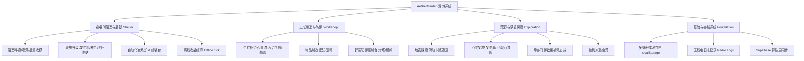
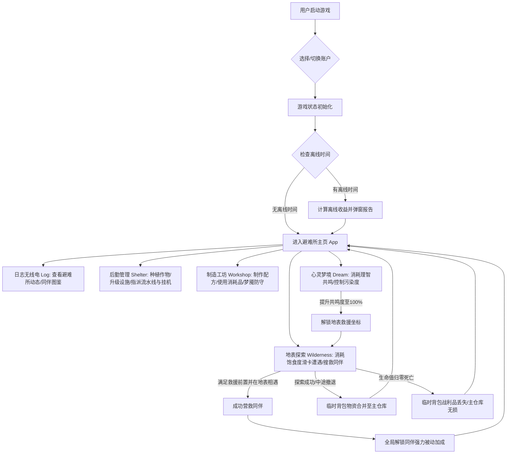

# Vibe Coding AI 产品设计方案

> AI Product Design Document
> 

---

# 封面

## 项目名称

> **AetherGarden**
> **废土魔导温室放置经营游戏**

---

## 项目信息

|   项目   |              内容               |
| :------: | :-----------------------------: |
| 项目名称 |  AetherGarden — 废土魔导温室   |
| 项目类型 | AI辅助开发的放置经营游戏 / Web  |
| 项目成员 |              张惏               |
| 指导老师 |             吴相海              |
| 完成时间 |           2026/07/13            |

---

# 目录

1. 项目背景与需求分析
2. 用户画像设计
3. 产品定位与价值
4. 产品功能架构
5. 用户体验流程设计
6. UI/UX设计方案
7. AI Agent设计方案
8. AGENTS.md文档设计
9. Prompt工程设计
10. Vibe Coding开发过程记录
11. 项目成果展示
12. 总结与未来优化方向

---

# 01 项目背景与需求分析

## 1.1 项目背景

**世界观设定**
魔能风暴席卷了地表，世界沦为一片死寂的废土。残存的人类只能退缩在地下避难所中，依靠微弱的“以太魔能”维持生命。避难所的核心是一座魔导温室，这里种植着各种吸收了辐射并产生变异的奇特植物——辐射荧光草能提供纤维，以太浆果能安抚焦躁的脑电波，而钢纹向日葵甚至能结出坚硬的合金。然而，避难所的资源正在枯竭，外部荒野充满危险，沉睡者的心灵深处也正被梦魇侵袭。作为避难所的管理员，你需要利用无线电信号指引荒野搜救，入梦净化受污染的心灵，把流散在地表的幸存者接回家，共同重建家园。

**我们为什么做《AetherGarden》？**
市面上的末日生存游戏往往玩起来太累，需要玩家投入大块的连续时间，紧绷神经去应对各种突发危机，不适合日常忙碌的上班族。而普通的挂机游戏又过于枯燥，玩家面对的只是一堆冰冷无限膨胀的数值，缺乏代入感，且很快就会因为千篇一律的看广告拿双倍收益而感到厌烦。

我们想在两者之间找到一个平衡点。把废土生存的危机策略与温室种植的安逸舒适拧在一起。玩家每天只需要花上几分钟，在网页端打理温室、工坊熔炼，通过简单的卡牌左右划动，就能在废土地表展开一场说走就走的探险。

---

## 1.2 痛点分析

在立项之初，我们梳理了轻度玩家在挂机和模拟经营类游戏里最常遇到的烦恼：

1. **时间碎片化与操作负担的冲突**
   上班通勤或下课茶歇只有三五分钟，打一把联机副本时间根本不够，而传统的挂机网页游戏往往要求前台一直在线才能计算产出。玩家需要一个可以随时关闭、在后台精细计算收益，并且在上线时能一键收菜的机制。
2. **数值无限膨胀带来的空虚感**
   许多放置游戏在游玩几天后，除了不断翻倍的数值外，没有任何世界观和角色互动。我们希望加入鲜活的同伴系统。被救回来的幸存者（罗伊、阿梅、赛罗等）有各自的废土背景，他们加入避难所后能带来切实的生产加成，让玩家能真正感受到“人在这个温室里活着”。
3. **系统孤立，缺乏长远目标**
   很多小游戏的种植、合成和探险各玩各的，玩着玩着就失去了继续建设避难所的动力。我们设计了一个完整的内循环：温室产出的荧光草和魔莲是工坊搓药品和扩建温室的原料；这些药品能维持探索地表和梦境的血线与理智值；而在地表探险救回来的同伴又能回到温室和组装台，实现生产线的自动化。
4. **强制广告与商业化撕裂体验**
   市面上的免费小游戏充斥着“看30秒视频拿3倍收益”的弹窗，极其破坏心情。我们坚持无广告设计，并将同步功能托管在 Supabase 上，结合本地多账户管理，给玩家一个纯粹、干净、不怕丢档的游戏环境。

---

# 02 用户画像设计

为了让产品设计更贴近真实体验，我们为《AetherGarden》勾勒了两位典型玩家的画像：

## 用户画像1

### 基础信息
* **姓名**：林晓
* **年龄**：24岁
* **职业**：初入职场的软件测试工程师
* **日常状态**：每天面临改不完的 Bug，通勤路上要挤单程 40 分钟的 2 号线地铁。工作压力大，脑力消耗严重。

---

### 用户需求
* 需要一款能在坐地铁时、或者吃外卖的 3 分钟间隙里随时拿出来点几下的解压游戏。
* 喜欢废土和科幻题材，比起冷冰冰的数字，更看重游戏里同伴互动的温度和故事感。
* 不想动用复杂的走位和高强度微操，但希望带有一点策略思考（比如研究怎样合理指派同伴干活）。

---

### 用户痛点
* 晚上下班后精疲力竭，玩不动需要高度专注或挫败感强烈的硬核动作游戏。
* 玩过的挂机游戏大多像个冷酷的计算器，没有角色弧光和家园重建的归属感。
* 极度反感各种为了领金币不得不反复观看的 30 秒强制广告。

---

### 使用场景

> **清晨 08:40 | 通勤地铁上**
> 
> 林晓在摇晃的地铁车厢里用单手划开手机，进入 AetherGarden。离线心跳算法自动结算了她昨晚睡觉期间的收益——发电机发了电，回收站自动把垃圾变成了废铁。她花 30 秒收割了温室里完全成熟的“以太浆果”，种下新种子，一键批量浇水，然后顺手安排罗伊去冶炼炉烧合金板，接着就把游戏关掉塞回兜里。
> 
> **中午 12:30 | 午餐间隙**
> 
> 外卖送达，她点开工坊折叠面板，用上午熔炼的合金和浆果搓了两个“理智胶囊”。随后，她消耗 20 点理智进入心灵梦境，用左右滑动卡牌的方式做梦，遇到了工程师罗伊的残留波段，罗伊的共鸣度累积到了 100%。无线电日志自动更新，提示罗伊的坐标已在地表“雷达站”解锁。
> 
> **夜晚 22:30 | 临睡前**
> 
> 躺在床上的林晓点开地表探索，派赛罗带上口粮前往雷达站。在连过 5 张遭遇卡牌后，顺利触发了救援事件，将罗伊救回了避难所。罗伊的加入让全局工坊能耗降低了 20%，她翻阅着罗伊的图鉴背景，带着一丝解压后的睡意关掉了手机。

---

## 用户画像2

### 基础信息
* **姓名**：陈默
* **年龄**：19岁
* **职业**：计算机专业大二学生
* **日常状态**：独立游戏重度爱好者，喜欢钻研游戏机制，对各种数据配比和效率最大化有强迫症。

---

### 用户需求
* 追求有深度和数据支撑的模拟经营系统，比如琢磨不同作物的成长期，或者算一算自动流水线怎么配比收益最高。
* 喜欢在多设备（宿舍 PC、上课时的平板、外出时的手机）上无缝切换玩游戏，要求存档能多端云同步。
* 反感粗制滥造的换皮小游戏，追求高对比度、有废土魔导霓虹质感的视觉风格。

---

### 用户痛点
* 大多数挂机游戏内容单薄，点两下就只能发呆，缺乏策略深度。
* 以前玩的网页游戏，一旦浏览器清理缓存或者换个设备，本地存档就丢了，导致直接被劝退。

---

### 使用场景

> **下午 15:40 | 课间休息**
> 
> 陈默在阶梯教室里用平板打开 AetherGarden。他没有登录账号，直接以 Guest 身份切到小号。他正在测试一套“纯挂机合金流”效率：用 8 个培养槽全种“钢纹向日葵”，收割后直接喂进自动化组装线。他通过计算公式，算出搭配罗伊的能耗降低和阿梅的生长提速，如何实现魔能产出与消耗的最佳平衡点。
> 
> **周末 10:00 | 宿舍内**
> 
> 陈默坐在电脑前，点开游戏顶部的生存者终端。他登录了自己的 Supabase 账号，一键将之前在平板和手机上同步的云端存档覆盖到本地。游戏界面闪过淡蓝色指示灯，他接着扩建他的第 8 个培养槽。即使宿舍网络偶尔断开，游戏也能静默切换为 LocalStorage 本地保存，没有任何弹窗报错，网络恢复后又会自动完成同步，这让他感到非常踏实。
# 03 产品定位与价值

## 3.1 产品一句话介绍

> 这是一个能装进口袋的废土温室放置经营游戏。玩家将在地下避难所打理魔导植物，在工坊熔炼合金与搓制药剂，通过简单的左右划动遭遇卡牌，在荒野中搜寻资源、救援幸存的同伴。无需频繁在线，离线心跳算法与弹性云同步将保证你的避难所即便在网络离线时也运转无误。

---

## 3.2 产品核心价值

1. **紧密咬合的资源内循环**
   游戏里的四大模块（温室、工坊、探索、梦境）是相互嵌套的齿轮。玩家在温室里种下“辐射荧光草”或“以太浆果”，收获魔能纤维和心灵碎片；在工坊中将这些植物产物与捡回来的废旧金属熔炼成合金、或者搓成“理智胶囊”、“净化血清”等药品；这些药品是前往受辐射荒野和深度梦境中保命的必需品；而在地表探险救回来的同伴（阿梅、罗伊等）又能回到后勤温室和自动化产线，提供全局性的增益加成，让生存链条实现正向反馈。
2. **生存者自治与半自动化成长**
   不同于普通挂机游戏单纯依靠数值升级，本作的核心在于“带回伙伴，分工协作”。每个幸存者救回复苏后，都会解锁独特的技能与故事。你可以把罗伊派去冶炼炉减少 20% 魔能开销，安排阿梅打理温室让作物成长加快 25%，或者让信使赛罗在外面带路减少 15% 的探索消耗。闲置的同伴还能派往雷达站或废弃地铁站挂机拾荒。当避难所的流水线挂满同伴时，那种逐渐由手动转为半自动、全自动的家园建设感是普通数值游戏无法比拟的。
3. **弹性云同步与分段离线心跳**
   为了适应移动端和碎片时间场景，底层设计了精确到秒级的“分段步进离线心跳（Offline Tick）”算法。当你离线时，发电机在继续发电，组装台在继续消耗材料合成合金。当发电机燃料（废铁）耗尽那一刻，系统会停止消耗，防止资源扣为负数或溢出。同时，Supabase 云同步支持断网下优雅降级——即使没有网络或密钥，本地 LocalStorage 依然正常存档，网络畅通后一键同步，彻底解决网页游戏易丢档的缺陷。

---

# 04 产品功能架构设计

## 4.1 产品功能模块



---

## 4.2 核心功能说明

### 1. 温室种植与灌溉
* **魔导变异作物**：避难所的土壤已遭侵蚀，但你可以种植各种具有奇特属性的植物。从生长最快、产出魔力微粒的“辐射荧光草”，到能够凝结出硬质合金的“钢纹向日葵”，再到在梦境裂隙中摇曳、用以提炼心灵药剂的“虚空魔莲”。每种作物均有其独特的生长时间和产出配比。
* **魔能灌溉与农学加成**：在种植槽中，消耗 2 点魔能浇水可让作物的成长时间瞬间减半。如果将救回来的农学家“阿梅”指派入驻温室，温室的全局作物生长速度将获得 25% 的常驻提速，让作物的成熟周期大幅缩短。
* **一键便捷操作**：随着工坊中温室设施的不断扩建，培养槽数量可从最初的 3 个扩展到最大 8 个。为避免繁琐的点击，种植界面提供了“一键种植”、“一键批量浇水”以及“一键批量收割”操作。
* **培养槽扩建**：扩建培养槽不仅需要废金属，还需要在工坊中消耗高阶零件搓出“温室扩建图纸”。每次扩建都会解锁新的土壤插槽，提供更宽敞的废土庄稼打理空间。

### 2. 工坊合成与梦魇防御
* **数据驱动配方表**：在工坊的组装台上，你可以依据静态配方消耗基础原料合成各种高阶物资，比如熔炼废铁制成合金板、消耗荧光草纤维制作简易电池等。当工程师“罗伊”归队并被指派入驻工坊后，所有配方的魔能消耗将永久减免 20%。
* **随用随取的避难所补给**：折叠面板里常备有各种生存必需品——喝一碗热炖汤可同时恢复魔能与饱食度，注射纳米药剂能补充生命值，而喝下净化血清则能清除心灵梦境中的污染。点击即可当场服用，不需要繁琐的背包整理。
* **梦魇防守与核心超频**：避难所绝非绝对安全。当警报响起、爆发“梦境泄露”危机时，整个避难所的系统都会遭到梦魇污染，温室植物停止生长，且管理员每秒都会扣除生命值。你必须在控制台消耗资源建立自动机枪塔进行物理防御，或者当场开启“核心超频”，以魔能超负荷过载的代价降低污染度，硬抗梦魔的侵蚀。

### 3. 地表荒野与心灵梦境的双轨探索
* **手势滑动卡牌抉择**：荒野探索采用滑卡机制。每一张卡牌代表一次未知的废土遭遇，向左向右滑动代表不同的决断。例如路遇废弃物资箱，左划“安全避让”（没有任何得失），右划“强行破拆”（消耗饱食度并获得废旧弹壳与齿轮）。
* **死亡惩罚与临时背囊**：探索荒野带回的物资会暂时存放在“临时背囊”中。如果贪刀导致生命值在中途归零，临时背囊里的所有战利品将全部丢失；只有在存活状态下选择“安全撤退”，或者成功完成区域搜救，物资才能真正合并入避难所的主仓库。
* **梦境共鸣与搜救线索**：消耗理智值“入梦”可以探索沉睡者的潜意识。在梦境中行走的每一步都会累积污染度，满 100% 后会持续扣除生命值。你可以使用“理智胶囊”或“跃迁胶囊”保命。在梦境中会随机遇到被困同伴的残留波段，通过交互累积共鸣度。当共鸣度达到 100% 时，无线电日志就会收到他们在废土地表的真实求救坐标。
* **伙伴挂机拾荒**：伙伴救回后，不能让他们在避难所闲着。对于不参与日常值班的同伴，可以派遣他们前往已解锁的地标（如雷达站、生化实验室、废弃地铁）进行挂机拾荒。在设定时间结束后，他们会带回大量的电子元器件与稀有矿石。

### 4. 后勤硬件与同伴分工
* **三大硬件升级**：发电机决定了魔能的挂机产出速率；蓄电池决定了离线魔能的储存上限；回收站则能定时变废为宝，自动磨碎各种废弃杂物产生废金属。
* **指派流水线值班**：冶炼炉与组装台可以配置自动化配方。你可以把罗伊或阿梅等同伴指派到对应工位值班。他们各自拥有的角色被动特长将直接应用到该工位的生产过程中，实现避难所材料的半自动化产出。
* **全局被动叠加**：同伴在获救的瞬间，其被动效果便会全局生效。如赛罗能常驻降低 15% 的探索消耗，巴斯特让捡废铁的数量增加 30%，多个同伴的加成可以相互叠加，让避难所在后期运转得越来越快。

---

# 05 用户体验流程设计（User Flow）

## 5.1 核心用户流程图



## 5.2 用户交互步骤描述

1. **唤醒与登录（多账户免密切换）**
   当玩家打开网页时，首屏会展示当前的生存者档案。玩家既可以使用默认的 Guest 账户快速进入，也可以在“生存者终端”输入代号唤醒全新的冷冻舱。系统支持多账户免密随时切换，方便进行不同生产流派的效率对比，所有数据全部静默持久化在本地 LocalStorage 中。
2. **结算离线生机（分段步进离线心跳）**
   游戏初始化时会自动核对上一次存盘时间。如果玩家离线了挺久，系统会启动分段心跳算法，精确模拟发电机燃料（废铁）的消耗量和熔炼炉的产出进度。当燃料耗尽时，产线会自动闭锁挂起，既防止玩家因长期不上线导致资源负溢出，又保障了“上线即收菜”的正面反馈。上线后，玩家将通过一个充满科幻感的弹窗报告，直观清点挂机期间带回的电力与物资。
3. **日常打理与组装派驻**
   进入避难所主页后，玩家先进入 Shelter（后勤）页签收割魔导温室里成熟的作物品种，并一键重新播种灌溉。接着来到工坊折叠面板，查看冶炼炉与组装台的材料缺口。通过拉开同伴指派列表，将闲置的罗伊派去烧铁、阿梅指派去催熟植物，看着避难所的数值指标在同伴特长加持下发生良性变动。
4. **入梦共鸣与荒野救人**
   这是《AetherGarden》最惊心动魄的探险阶段，分为两个咬合步骤：
   * **潜意识入梦**：玩家消耗理智值潜入心灵深处，通过随机遭遇的梦境卡牌寻找流散同伴的脑电波波段。每走一步都会积累污染度，需要吃“理智胶囊”或使用血清净化自己。当与某位同伴的共鸣度达到 100% 时，无线电会收到其发出求救的具体地表坐标。
   * **地表滑卡救援**：解锁坐标后，玩家携带干粮出发。在地表探索中，每一次滑卡抉择都会影响探险员的生命值和饱食度。捡到的铁片与原件先存入临时背囊。在探索的第 5 步会遇到对应的同伴搜寻事件。如果满足前置物品需求，便能成功把同伴带回避难所。一旦探险途中生命归零，临时背囊里的战利品全部清空，只保留主仓库，充满了生死一线的博弈感。
5. **基地半自动化与挂机拾荒**
   把罗伊、阿梅、赛罗等人接回家后，基地的全局生产能耗、温室催熟和探索口粮减免等被动特长便全部生效。此时，玩家可以规划将不值班的同伴派往废弃雷达站、生化实验室等地挂机拾荒，带回更高级的元器件，让避难所从最初的艰难求生，逐渐走向全面电气化与半自动化自治。

---

# 06 UI/UX设计方案

## 6.1 产品视觉定位

我们将《AetherGarden》的美术风格定位为**废土魔导朋克（Aetherpunk）**。主基调模拟为地下千米深处阴冷、黑暗的密封钢结构避难所，但通过极其刺眼的荧光绿（代表温室植物生命）、电力蓝（代表发电机能源与工坊）和以太紫（代表心灵梦境与共鸣）营造强烈的科幻对比。

所有操作面板均被设计为磨砂毛玻璃卡片（`backdrop-blur-md`），边缘带着极细的半透明冷灰边框（`border-zinc-800/40`），重叠悬浮于深黑色底色之上。卡牌拖拽时应用了物理阻尼回弹和旋转跟随算法，每次轻扫卡片，都带有一种翻折实体质感卡牌的解压手感。

---

## 6.2 色彩设计

我们在样式系统里配了一套极具末日魔导感的冷暖对照色彩，用于引导玩家的视线与状态识别：

| 变量名称 | 色值 | 视觉含义及应用场景 |
| :--- | :---: | :--- |
| `--color-waste-bg` | `#0a0b0d` | **废土夜空黑**：主背景底色，渲染地下掩体幽暗、压抑的求生氛围。 |
| `--color-waste-card` | `rgba(18,20,24,0.7)` | **舱室玻璃灰**：半透明毛玻璃底板，所有界面浮窗与面板容器的基底。 |
| `--color-magic-purple` | `#bd00ff` | **以太梦魔紫**：代表心灵梦境、同伴共鸣值、理智值药品及梦境折叠面板。 |
| `--color-magic-green` | `#39ff14` | **辐射荧光绿**：象征植物成熟、批量收割信号、良性加成与健康饱食状态。 |
| `--color-magic-blue` | `#00f0ff` | **蓄能魔能蓝**：用于电力、发电机、工坊升级等设备，引导玩家进行后勤建设。 |
| `--color-warn-red` | `#ff0055` | **警戒辐射红**：提示血线告急、梦魇侵袭警报、理智值耗尽及滑卡失败的扣除。 |

---

## 6.3 页面设计

### 页面1：避难所后勤页面（Shelter Tab）
* **顶部硬件状态舱**：发电机、蓄电池、回收站以三块独立的毛玻璃卡片并排悬浮在顶部。当资源满足升级条件时，卡片下方的升级按钮会亮起“电力蓝”的霓虹发光投影；资源不足时则呈现灰色半透明的闭锁状态。
* **温室种植网格**：8 个培养槽按九宫格样式排布。每个卡槽的左侧显示作物的 Emoji（如 🌿、🪷）以及淡绿色的生长进度条，右侧为魔能浇水按钮。被魔能浇过水的培养槽边缘会常驻一圈荧光绿的呼吸灯特效，视觉上生机盎然。
* **流水线挂机舱**：采用紧凑的折叠手风琴面板，默认收纳合成进度。展开后可直观清点冶炼炉与组装台的原材料存量，并通过点击人物头像，将阿梅或罗伊放入流水线“打工槽”中。

### 页面2：地表荒野探索页面（Wilderness Tab）
* **生命维持监视器**：细长的高纯度橙色饱食条和红色生命血槽贴紧在页面顶部，红色闪烁的低健康状态会时刻拉紧玩家的求生神经。
* **卡牌滑屏交互区**：遭遇卡片浮动在页面中心。玩家通过鼠标或手指左右划动卡片进行抉择。滑卡时带有 200ms 的偏转角度阻尼和透明度渐变。左划代表“溜之大吉”（避开危险，无得无失），右划代表“迎难而上”（消耗资源，获得物资），操作回弹力道干脆清爽。
* **底部临时背囊**：用带有斑驳警戒条纹的灰黑容器隔开，捡到的物资在此处呈方格排布。如果撤退成功，方格会闪过一圈绿色发光动画并入库；若探险员死亡，临时背包则会全部变成红色并闪烁，最后清零。

---

## 6.4 UI优化细节与交互反馈

1. **拟真磨砂玻璃与霓虹发光**
   摒弃了之前版本单调的直角灰色大方块，引入了 `backdrop-blur-md` 物理磨砂玻璃和 neon box-shadow 发光灯带。玩家在面对几十个数据项时，不需要通读文字，仅凭卡片边缘亮起的绿色发光（作物熟了）或蓝色发光（可升级）就能瞬间做出直觉反应。
2. **轻量折叠面板，适配单手操作**
   为兼容移动端网页运行，补给品吃药、流水线选择等高频交互被全部整合在折叠抽屉中。展开和收起伴随顺滑的垂直缩放，保证所有交互在单屏 5 寸手机画面内即可用大拇指触控完成，消除了上下滑动翻页的疲劳感。
3. **带有阻尼的 SwipeCard 物理手势**
   针对滑动遭遇卡手势进行了优化。基于拖拽位移的比例加入物理回弹和弧度偏转，划走卡片时的甩尾感利落且稳定，为频繁的遭遇抉择增添了解压的爽快感。
4. **渐显式 Tab 页签切页**
   在各个 Tab 页面之间切换时，新页面会伴随 `tab-enter` 动画——在 200ms 内，新容器从下方 8 像素处呈渐显状态缓缓升起。这种平滑过渡极大地缓解了直接切页的突兀感。

---
# 07 AI Agent设计方案（核心）

## 7.1 Agent 角色定义

Agent 名称：**AetherGarden-DevAgent**（AetherGarden 智能开发与重构 Agent）

Agent 身份与职责：
> 你是熟悉 React 19、Vite 8 与 Tailwind CSS 4 的地下避难所开发助手。在协助人类进行《AetherGarden》的系统重构和内容扩展时，你必须对“以太魔能”、“离线结算步进”和“生存者全局被动”等游戏设计具有深层的逻辑认知。在修改代码时，你需要死守状态机的稳定，保证新写的每一行代码都符合高标准的健壮性。

---

## 7.2 Agent 核心目标

* **配置化数据驱动扩展**：新增关卡、作物种类、合成配方或救援事件时，只在 `src/data/` 目录下的静态配置文件中进行编辑，严禁将数值硬编码进 UI 组件中，以防引起逻辑耦合。
* **TypeScript 严格模式**：统一遵守 `tsconfig.app.json` 的 TS 规范，如类型必须用 `import type` 导入，禁用 `enum`，消灭任何未使用的本地变量与函数参数。
* **Vitest 单元测试覆盖率**：在交付前，必须运行 Vitest 确保所有的状态机和冒烟测试全部通过，杜绝将任何导致老用例报错的代码合并入库。

---

## 7.3 Agent 能力边界

* **离线心跳算法仿真**：吃透 `GameContext.tsx` 里的离线心跳仿真，能模拟燃料烧尽时发电机和组装线自动停机的步进逻辑。
* **虚拟时空沙盒**：熟练运用 `vi.useFakeTimers()` 加速时空，并在 localStorage 中注入 mock 存档，对高负荷和异常离线状况进行极限测试。
* **单机优雅降级**：调用 Supabase 云端实例时，必须做好 try-catch 拦截。在网络故障或缺失 env 密钥时，要让客户端静默挂起并隐藏同步挂件，确保单机本地体验顺畅。

---

## 7.4 Agent 开发流程

```Plain Text
理解新设计逻辑（例如在 crops.ts 中追加“时光藤蔓”作物）
↓
修改静态配置数据表（src/data/crops.ts）
↓
在 GameContext.tsx 或相关组件中，遵循 import type 严格类型导入追加逻辑
↓
在终端运行 npm run lint (oxlint) 检查 Hook 依赖及格式
↓
运行 npx vitest run 确保老测试未被破坏，新用例 100% 跑通
↓
发布交付，更新实践记录，提交至 Git 仓库
```

---

# 08 AGENTS.md 文档设计（必须）

我们把项目根目录的 `AGENTS.md` 做成了 AI 开发助手的“防错说明书”。当新的 AI 接入项目时，只需阅读此文档，就能立马明确开发命令、Ts规范、测试规约以及项目底层架构。

### 核心模块规范提炼：

* **自动化开发命令**：
  * `npm run dev`：启动本地 Vite 开发服务器。
  * `npm run build`：先执行 `tsc -b` 类型检查，再执行 `vite build` 进行打包，顺序绝对不能错。
  * `npm run lint`：跑 `oxlint` 静态代码检查（本项目不使用沉重的 ESLint）。
  * `npx vitest run`：运行所有单元测试。
* **TypeScript 严格规范**：
  * `verbatimModuleSyntax: true`：类型导入必须加上 type 关键字。
  * `erasableSyntaxOnly: true`：禁止使用 `enum`、`namespace` 以及参数属性。
* **测试编写规约**：
  * 组件测试必须包裹在 `<GameProvider>` 和 `<ToastProvider>` 里面。
  * 测试前，必须往 localStorage 中注入 `aether_garden_save_Guest` 模拟特定的初始化存档。
  * 测试作物生长、离线结算时，必须调用 `vi.useFakeTimers()` 来模拟时空流逝。
* **存档与同步降级**：
  * 存档的命名格式为 `aether_garden_save_${username}`。
  * 云端同步代码必须做好 try-catch，在未配置密钥时静默隐藏同步挂件，防止首屏崩溃。

---

# 09 Prompt 工程设计

## 9.1 初始 Prompt

在刚开始生成项目时，我们使用的提示词较为粗糙：

```Plain Text
用 React + Vite + Tailwind CSS 制作一个简单的放置挂机游戏，包含植物种植、时间流逝和本地数据保存。
```

**初始 Prompt 的弊端：**
AI 经常把作物的生长时间、合成原料数量直接硬编码在 JSX 逻辑里，导致后期稍微调整数值就需要大面积修改 UI 组件。同时，离线结算只是简单做时间乘法，导致玩家长期离线后资源被扣成负数。一旦断网，Supabase 初始化报错还会导致首屏白屏。

---

## 9.2 优化后的 System Prompt

我们对提示词进行了深度迭代，为 AI 设定了如下系统规则：

```Plain Text
我们来做个名为 AetherGarden 的废土魔导温室放置经营游戏。规则和规范如下：
1. 技术栈：用 React 19 + Vite 8 + Tailwind CSS 4 写，用 Vitest 写测试。
2. 架构要解耦：走“数据驱动”路线。将作物种类、制造图纸、同伴数据、探索事件全丢在 src/data/ 下面的配置文件里。UI 组件只管读取渲染，不写死任何数据。
3. 全局状态机：把状态更新和多存档切换全写在 src/context/GameContext.tsx 里，秒级自动存盘。还要基于 lastTick 时间戳写一套精准的“离线心跳（Offline Tick）”算法。
4. UI 页面划分：
   - LogTab（日志）：看无线电八卦和同伴档案。
   - ShelterTab（后勤）：种地浇水、升设施等级、安排同伴在流水线合成材料。
   - WorkshopTab（工坊）：做胶囊、做配方，还能启动“梦魇防御”抗怪。
   - WildernessTab（荒野）：用 SwipeCard 实现卡牌左右滑动遭遇，捡来的东西放“临时背包”，角色死掉就把临时背包清空。
   - DreamscapeTab（梦境）：入梦消耗理智，避开梦魔，积累共鸣度解锁同伴地标。
5. 优雅降级：Supabase 云同步是可选的。要是本地没配置 env 密钥，直接把同步挂件隐藏掉，本地 LocalStorage 依然能无缝单机游玩。
6. 严格规范：tsconfig 里要强制用 import type 导入类型，禁用 enum，并用 Oxlint 规范 Hooks 写法。
```

---

## 9.3 提示词迭代优化过程说明

* **数据表分离规避逻辑耦合**：强制把所有道具、作物、配方数据移至 `src/data/` 目录。在新增“时光藤蔓”或“雷暴幼芽”等新要素时，AI 只需要在 static 数组中加一行数据，UI 表现组件（如 ShelterTab）无需更改任何逻辑，大幅减少了代码修改造成的 Bug。
* **分段步进法模拟离线心跳**：放弃了“离线秒数 * 发电效率”的简单乘法公式。在 Prompt 中明确要求：离线结算必须采用基于燃料存量的“分段模拟”。每秒推演一次，在燃料扣减到零的那一刻，立刻关闭发电机与流水线，防止燃料扣为负值，离线产出更加真实。
* **以优雅降级守住求生线**：指导 AI 在调用 Supabase 云同步等外部接口时，做好 try-catch。如果没有检测到本地 env 密钥或断网，一律以 null 客户端降级运行，并在前端静默把同步挂件藏起来。这使得玩家在纯本地单机localStorage 模式下依然能顺畅游玩。

---

# 10 Vibe Coding 开发过程记录

## 10.1 开发工具箱

* **Antigravity**：我们的核心 AI 编程助手，负责修改代码、执行测试并推进开发进度。
* **Oxlint**：用 Rust 写的代码检查工具，比传统的 ESLint 快上百倍，保存代码时瞬间就能指出 Hook 依赖项写错的问题。
* **Vitest & jsdom**：用来写单元测试和模拟浏览器 DOM 的冒烟测试，极速响应。
* **Git**：每次重构或者加功能时进行版本管理，方便出问题时一键回滚。

---

## 10.2 精细化的开发流程

```Plain Text
理清温室、地表卡牌、梦境救援的联动闭环
↓
用 TS 定义好全局数据类型接口（src/types/game.ts）
↓
生成核心状态机 GameContext.tsx，搞定离线分段步进算法
↓
开发 5 个主要 Tab 分页，手写 SwipeCard 物理阻尼卡牌滑动组件
↓
接入冶炼炉/组装流水线，接入 Supabase 弹性云同步
↓
用 Oxlint 静态扫码，消灭 Hook 依赖和类型问题
↓
运行 Vitest 执行 GameContext.test.tsx 与 smoke.test.ts
↓
根据测试报错让 AI 迭代修复，发布 100% 测试通过版
```

---

## 10.3 避避坑记录与解决方案

1. **Vite 编译报 verbatimModuleSyntax 严格类型导入错误**：
   * *问题*：AI 在写 React 导入语句时，喜欢把普通变量和 TS 类型写在同一个 `import` 块中。这在严格模式下会导致编译打包失败。
   * *解决方案*：我们在 `AGENTS.md` 中规定，AI 必须使用 `import type { GameState }` 来专门导入类型。配合 Oxlint 的检查，发现写错就立即自动修复。
2. **离线时间过长导致发电机燃料扣为负数**：
   * *问题*：离线时间过长时，直接用时间相乘会导致发电机超额运作，燃料不仅被扣为负数，电力产出也发生了凭空膨胀。
   * *解决方案*：重写了 `GameContext.tsx` 里的离线结算段落。采用步进法计算，先算出剩余燃料能支持发电机运作多久。燃料耗尽那一秒，立即关停发电机和产线，保护数据安全。
3. **Supabase 未配置密钥时首屏白屏崩溃**：
   * *问题*：无网游玩或未配置 `.env` 里的 Supabase 密钥时，前端由于 Supabase 客户端初始化报错而引发白屏。
   * *解决方案*：在 [lib/supabase.ts](file:///e:/系统/文档/GitHub/IdleCozyGame/src/lib/supabase.ts) 中对初始化添加了 try-catch。如果没有配置密钥，直接返回 null 实例，并在前端隐藏同步小组件，实现优雅降级。

---

# 11 项目最终成果展示

## 11.1 功能实现清单

* ✅ **温室种植与一键收播**：设计了辐射荧光草、虚空魔莲等 7 种变异作物，支持一键播种、浇水（时间减半）及批量收获，完美兼容离线心跳结算。
* ✅ **后勤设施与半自治流水线**：发电机、蓄电池、回收站可消耗金属板进行升级。冶炼炉和组装台支持将罗伊或阿梅派驻值班，利用其被动特长自动合成材料。
* ✅ **左右划卡遭遇与双轨救援**：荒野探索采用滑卡机制，战利品存入临时背包，一旦死亡临时背包清空。梦境探索消耗理智值，共鸣度达到 100% 后可解锁地表被困伙伴的精确搜救坐标。
* ✅ **LocalStorage 存档与云端备份**：支持多账号一键切档，自动秒级保存。可选接入 Supabase，在无网络时自动降级为本地单机版运行，不崩盘。

---

## 11.2 演示地址与包路径

* **本地热重载运行地址**：[http://localhost:5173](http://localhost:5173)
* **Demo 视频路径**：`/docs/AetherGarden_Demo_Video.mp4`（演示了建立多账号存档、离线 Tick 步进、梦境共鸣到最终成功救回罗伊的 3 分钟核心闭环）。

---

# 12 总结与未来优化方向

## 12.1 当前版本不足

1. **云备份配置繁琐**：目前的 Supabase 备份需要玩家自己在本地修改 `.env` 配置文件，门槛较高。后续应支持基于 Auth 的社交账号一键登录同步。
2. **梦魇防守互动单薄**：目前的“梦魇防御”本质上只是一次简单的每秒扣血数值比拼，玩家只需要升级炮塔或超频防守即可，缺乏有动作交互的怪兽战斗体验。
3. **伙伴归家后缺少互动**：救回罗伊、阿梅等人后，除了派驻组装台和挂机拾荒外，同伴在避难所内没有日常对话与突发趣闻，个性和情感深度有待发掘。

---

## 12.2 未来迭代方向

* **社交一键同步**：接入 Supabase Auth，支持玩家使用 Google 或 GitHub 账号一键登录，在无需手动配密钥的情况下实现多端云存档同步。
* **同伴自治（Multi-Agent System）**：引入本地轻量语言模型，为罗伊、阿梅指派大模型“小大脑”。让他们根据避难所当前的材料库存自主决定今天去种地还是去炼合金，形成一个真正智能的地下自治家园。
* **原生移动端打包**：使用 Capacitor 将游戏打包成 iOS/Android 原生 APP 并在手机端运行，使手势滑动遭遇卡牌的手感更加解压、真实。

---

# 附录：项目文件结构

```Plain Text
IdleCozyGame
├── docs
│   ├── project_architecture.md            # 项目架构与设计规范
│   ├── spritesheet_generation_guide.md    # 雪碧图美术生成指南
│   └── Vibe Coding AI 产品设计方案.md     # 本产品设计书
├── public                                 # 静态美术、作物理性图标资源
├── src
│   ├── assets                             # 游戏本地图层插画
│   ├── components                         # 前端 React UI 组件
│   │   ├── ShelterTab.tsx                 # 避难所管理与温室
│   │   ├── WorkshopTab.tsx                # 工坊制造与梦魇防御
│   │   ├── WildernessTab.tsx              # 荒野滑卡探险与救援
│   │   ├── DreamscapeTab.tsx              # 心灵梦境与同伴共鸣
│   │   ├── LogTab.tsx                     # 避难所无线电日志与同伴图鉴
│   │   ├── SwipeCard.tsx                  # 仿原生滑卡遭遇组件
│   │   ├── ToastSystem.tsx                # 吐司消息提醒
│   │   └── CloudSyncWidget.tsx            # Supabase 同步小组件
│   ├── context
│   │   └── GameContext.tsx                # 全局状态管理机 (离线 Tick/核心业务逻辑)
│   ├── data                               # 数据驱动静态配置文件目录
│   │   ├── crops.ts                       # 作物数据
│   │   ├── recipes.ts                     # 工坊制造配方
│   │   ├── survivors.ts                   # 幸存者背景与加成
│   │   ├── autoRecipes.ts                 # 自动化流水线配方
│   │   ├── expeditionLocations.ts         # 地表探索与救援点
│   │   ├── rescueEvents.ts                # 地表救援事件
│   │   ├── shelterUpgrades.ts             # 设施升级路径与公式
│   │   ├── gameConstants.ts               # 全局数值常量
│   │   ├── nightmareConfig.ts             # 梦魇防御数值配置
│   │   ├── initialState.ts                # 初始状态
│   │   ├── realityEvents.ts               # 地表探索随机卡牌池
│   │   └── dreamEvents.ts                 # 梦境探索共鸣卡牌池
│   ├── lib
│   │   └── supabase.ts                    # Supabase 弹性初始化降级客户端
│   ├── types                              # 全局 TypeScript 接口声明
│   │   ├── game.ts                        # 核心状态机接口
│   │   └── config.ts                      # 配置数据结构类型
│   ├── App.tsx                            # 游戏主框架入口与全局导航
│   ├── index.css                          # Tailwind v4 全局主题样式
│   └── main.tsx                           # React 应用挂载
├── package.json                           # 项目配置依赖与开发命令
└── tsconfig.app.json                      # 极严 TypeScript 校验配置文件
```

---

# 提交要求

## 最终提交内容：

✅ Vibe Coding 项目代码

✅ 产品设计方案报告（PDF/Word/Markdown）

✅ AGENTS.md 文件

✅ 项目演示视频（3分钟以内）

✅ UI 优化前后对比截图
