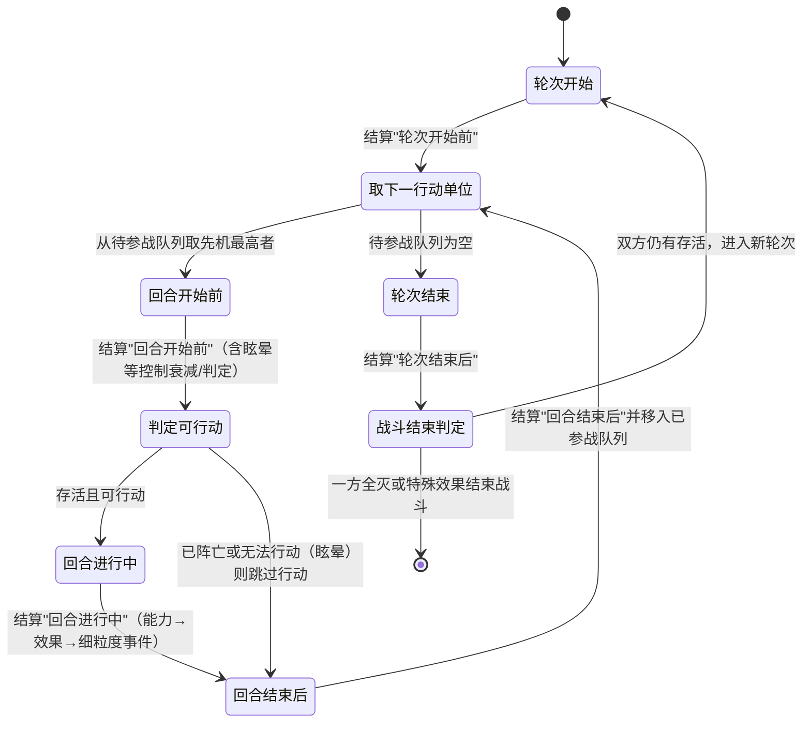

# 概述

战斗分为多个**轮次(Round)**，每个轮次中所有参与战斗的未死亡单位都拥有一个**回合(Turn)**，回合次序由**先机**属性决定。

## 时机（事件）分类学

战斗的时机分为两层：**轮次主时机** 与 **细粒度战斗事件**。效果与 Buff 的触发都挂在这两层上。

### 轮次主时机

> **轮次开始前**：每个轮次正式进入前，用于预计算回合次序、技能时机等。
>
> **回合开始前**：每个回合正式进入前，用于技能时机、判定单位是否阵亡/无法行动（如眩晕）以决定是否跳过等。
>
> **回合进行中**：每个回合正式执行中，用于技能时机、攻击行为等。
>
> **回合结束后**：每个回合完全结束后，用于技能时机等。
>
> **轮次结束后**：每个轮次完全结束后，用于技能时机。

### 细粒度战斗事件

在"回合进行中"内，一次具体行为会派发更细的事件，效果/Buff 可挂在这些事件上：

> **攻击后**：某单位完成一次攻击行为后。
>
> **受到伤害**：某单位承受一次伤害效果时（含作用前/作用中/作用后，见 Effect.md）。
>
> **受到治疗**：某单位承受一次治疗效果时。
>
> **效果生效**：任意效果落地后。
>
> **死亡**：某单位阵亡时。
>
> **召唤**：某单位被召唤入场时。

以上事件可继续扩展；轮次主时机是固定骨架，细粒度事件在能力/效果结算过程中即时派发。

## 先机 (Initiative)

- 先机值在**正式进入战斗前计算一次**，战斗内维护一个优先队列，决定下个回合由谁行动。
- 先机不对玩家暴露具体值，但开发者应有渠道知道。
- 公式：$100 + \frac{agility}{agility + 100} \times 100 + clamp(fixval, 0, 100)$，其中 `agility` 为元属性，`fixval` 为特殊单位（召唤物、boss 等）的修正值；英雄初始 `fixval = 0`。先机上限 300。
- 战斗中先机可能因技能/buff 变动，但**只会以固定 int 值加算/减算 `fixval`**；战斗中对 `agility` 的影响不会改变先机值。
- **召唤物**：先机的初始值只在战前对已入场单位算一次；召唤物其余值全为 0，仅在创建时由技能传入 `fixval`，并进入**本回合的待参战队列**——即召唤出来立即参战。

## 时机维护

每个时机拥有一个注册机制及对应的效果映射列表。需要依靠时机发动的效果，须向总的轮次管理系统申请：哪个时机、效果实例辨识字段、来源、目标、具体效果内容。

每个时机进行时按注册顺序（必要时逆序）结算效果；某效果结算可能产生：在另一个时机注册新效果、在当前时机注销某效果等。

> 约束（防递归与保证确定性）：
> - 反伤类效果不复用伤害效果，避免无止境递归（见 Effect.md）。
> - 同一时机结算期间新注册到**同一时机**的效果，延后到下一次该时机结算，不在本轮迭代中触发。
> - 引擎以固定顺序遍历，配合 RNG 种子保证同一输入得到同一结果（挂机回放/离线结算依赖确定性）。

## 回合状态机

要点：

- **眩晕/无法行动的衰减发生在"回合开始前"**：先结算该单位"回合开始前"的效果（眩晕在此衰减、并可能因意志减免提前结束），随后才判定是否可行动；不可行动则跳过"回合进行中"，直接进入"回合结束后"。
- 阵亡单位不进入"回合进行中"；已阵亡单位从待参战队列取出后直接跳过。
- 召唤物立即进入**本回合待参战队列**，可在同一轮次内行动。

## 预期流程

1. 计算所有参战单位的属性快照。
2. 计算所有参战单位的先机初始值，维护待参战优先队列与已参战优先队列。
3. 结算所有"轮次开始前"的效果。
4. 从待参战队列取先机最大者：按状态机走完"回合开始前 → 回合进行中 → 回合结束后"，随后移入已参战队列。
5. 反复执行 4 直到待参战队列为空，结算所有"轮次结束后"的效果。
6. 反复执行 3–5，直到某一方所有单位阵亡，或特殊效果使战斗结束。
